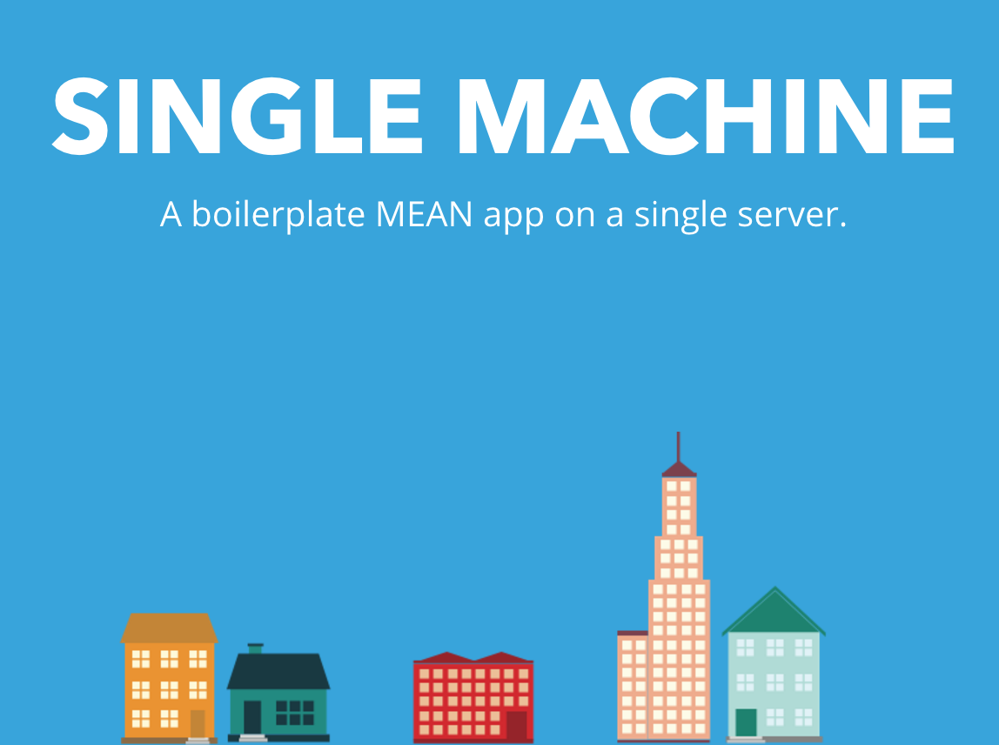

# SINGLE MACHINE
> A boilerplate MEAN app on a single server.



## Introduction
This boilerplate is designated to the beginner/intermediate web developer who wishes to get a jump start into deploying a cloud MEAN web app. Many of the features included are required by most production deployments, and therefore I hope I may help you get your to scalability on AWS. This software is free to use under MIT.

## Features
- MEAN (MongoDB, Express, Angular, node.js) full-stack framework - _A blazing fast stack for efficient modern web applications, using NoSQL key-value storage with MongoDB, Express for route handling, Angular for a clean and responsive frontend, and node.js to tie the API together._
    
- AWS CodeDeploy Scripts - _Allows your cloud servers to listen for commits to a Github repo's master branch, and gracefully update. This can be used among a load-balanced network, allowing you to build at scale,_
    
- User Authentication with [Satellizer](https://github.com/sahat/satellizer) - _A reliable end-to-end token-based authenticator for Angular that provides security and simplicity to your application,_

- AWS S3 Uploads - _A staple in web applications, allowing users to upload large files without bogging down your expensive mongo store,_

- Error handling and API logging to [Loggly](https://www.loggly.com/) - _Production logging is an important aspect to solve unforeseen bugs or unstable components of your API,_

- GULP minify support - _Gulp and minification of your JS and CSS files can speed up your load times and obfuscate your code from hackers,_

- User Validation/[Recaptcha](https://www.google.com/recaptcha) - _Google reCaptcha2 provides excellent protection from potentially malicious bots trying to create accounts on your system,_

- Maintenance Mode - _Sometimes, downtime is required to rebuild databases or stop production systems while maintenance is conducted,_ 

- [MailChimp](https://www.mailchimp.com) - _Upon signup, users can be automatically placed into a Mailchimp mailing list to start receiving marketing emails,_ 

- Password Reset - _Password reset functionality through email using Nodemailer._ 

## Development Installation
> This guide assumes you're on a Mac. The process should be similar on a PC.

1. Download the zip file and extract to your local machine,

2. Using terminal, install the node.js runtime locally,
```
ruby -e "$(curl -fsSL https://raw.githubusercontent.com/Homebrew/install/master/install)"
brew update
brew doctor
export PATH="/usr/local/bin:$PATH"
brew install node
npm install -g grunt-cli
```

3. Navigate to the extracted folder and install necessary node modules,
```
cd "/Users/*USER*/Desktop/Single Machine"
npm install
```

4. Install and run MongoDB locally
```
brew install mongodb
mongod
```

5. In another terminal window, run server.js
```
node server
```

## Production Installation

#### AWS SETUP
1. In Identity & Access Management (IAM), create a new role with **AmazonEC2FullAccess, AWSCodeDeployFullAccess,** and **AWSCodeDeployRole** policies,
2. Create a new user called "GitHub" and grant **AWSCodeDeployFullAccess**, and save their Access Token & Secret,
3. Launch a new Amazon Linux AMI EC2 Instance (Free-Tier, 8GB) with the IAM role from (1), include all HTTP traffic and open SSH for your IP, 
4. In AWS Code Deploy, create a new application and ensure app name and group are alphanumeric with _, no dashes or other characters,
5. Create a new deployment group called "production".

#### GITHUB SETUP
1. Create GitHub token repo_deployment token in GitHub personal access settings,
2. Create a new public or private repo,
3. In repo settings, webhooks and services, set up **GitHub Auto-Deployment**,
4. Then, set up **AWS CodeDeploy**, and use the IAM User "GitHub" AWS Access Key & Secret, and CodeDeploy app name and deployment group set previously.

#### EC2 SETUP
1. SSH to instance,
```
sudo chmod 600 *KEYNAME*.pem 
ssh -i keys/*KEYNAME*.pem ec2-user@*EC2PUBLICDNS*
```

2. Upgrade System (YUM),
```
sudo yum update
```

3. Install NodeJS,
```
curl -o- https://raw.githubusercontent.com/creationix/nvm/v0.33.8/install.sh | bash
. ~/.nvm/nvm.sh
nvm install --lts
sudo ln -s /usr/local/bin/node /usr/bin/node
sudo ln -s /usr/local/bin/npm /usr/bin/npm
sudo ln -s "$NVM_DIR/versions/node/$(nvm version)/bin/node" "/usr/local/bin/node"
sudo ln -s "$NVM_DIR/versions/node/$(nvm version)/bin/npm" "/usr/local/bin/npm"
```

4. Install Code Deploy Agent,
```
sudo yum install ruby
sudo yum install wget
cd /home/ec2-user
wget https://aws-codedeploy-us-east-1.s3.amazonaws.com/latest/install
sudo chmod +x ./install
sudo ./install auto
sudo service codedeploy-agent status
```

5. Install PM2,
```
npm install pm2 -g
sudo su -
sudo npm install pm2 -g
exit
sudo ln -s /usr/local/bin/pm2 /usr/bin/pm2
```

6. Install GULP,
```
npm install gulp -g
sudo su -
sudo npm install gulp -g
exit
sudo ln -s /usr/local/bin/gulp /usr/bin/gulp
```

8. Open Port 80 Listening,
```
sudo yum install libcap2-bin
sudo setcap cap_net_bind_service=+ep `readlink -f \`which node\``
```

7. (Optional) Set up HTTPS/Load Balancing by using Route 53, EC2 Load-Balancer, EC2 Auto-Scale Group.

#### FINISHING UP
1. Create a new account and MongoDB sandbox at [mLab](https://mlab.com/),
2. Copy the `mongodb://` url in the tools/config.json file under `production.mongo.uri`
3. Push commit to master branch,
4. In CodeDeploy, deploy a new revision,
5. Select "My application is stored in GitHub", and connect,
6. Enter your repository name and last commit id,
7. Your server should now be accessible at your EC2 DNS.

#### FURTHER DEVELOPMENT
> These features can be switched on/off by their respective booleans in tools/config.json
1. [Amazon Web Services](https://aws.amazon.com) S3: Create a new S3 bucket for photos AWS, and include your access key and secret key in tools/config.json,
2. [Loggly](https://www.loggly.com/): Add your token and subdomain to tools/config.json,
3. [Google Recaptcha](https://www.google.com/recaptcha): Add your secret to tools/config.json and your public key to /app/controllers/validate.js,
4. [MailChimp](https://www.mailchimp.com): Adding your API key and list to tools/config.json,
5. [HTTPS](http://docs.aws.amazon.com/ElasticLoadBalancing/latest/DeveloperGuide/elb-create-https-ssl-load-balancer.html): May be added to your load-balancer, and node will automatically redirect HTTP traffic to the HTTPs endpoint,
6. [Gulp](http://gulpjs.com/): Gulp is automatically run on production, you can comment out the .js and .css files in main.ejs and include the two generated ones in the asset folder (May cause artifacts).

## Notes
+ Every commit to the master branch done locally will automatically deploy and restart on your EC2 (if CodeDeploy is set up correctly),
+ There should not be a need to ever SSH back into the EC2, PM2 handles all crashes/faults,
+ Develop locally! It's much easier and quicker to keep things local by running `mongod` in a terminal,
+ [WebStorm](https://www.jetbrains.com/webstorm/) is a great tool to work locally, alongside [Chrome]([https://www.google.com/chrome) for inspecting.
+ One might think that MongoDB should run on the single machine as well, and the mongo uri is localhost. That would make the entire app actually exist on a single machine. While it works locally, and it might look cool on paper within the cloud, there is no easy way of scaling such a setup.

## Licence
[MIT](LICENSE)

## Resources
+ [MongoDB](https://www.mongodb.com/)
+ [Express](https://expressjs.com/)
+ [AngularJS](https://angularjs.org/)
+ [Node.js](https://nodejs.org/en/)
+ [Amazon Web Services](https://aws.amazon.com)
+ [MailChimp](https://www.mailchimp.com)
+ [MLab](https://www.mlab.com)
+ [Google Recaptcha](https://www.google.com/recaptcha)
+ [PM2](http://pm2.keymetrics.io/)
+ [Satellizer](https://github.com/sahat/satellizer)
+ [Mongoose](http://mongoosejs.com/)
+ [Gulp](http://gulpjs.com/)
+ [Nodemailer](https://nodemailer.com/)
+ [Sitemap.js](https://github.com/ekalinin/sitemap.js)
+ [Underscore.js](http://underscorejs.org/)
+ [Async](https://github.com/caolan/async)
+ [WrapKit](http://bootstrapbay.com/theme/wrapkit-responsive-admin-template-B14B7AB)

EOF